DO10 - BasicK8s

## Содержание 

0. [Part 0. База по кубу](#part-0-база-по-кубу)  
1. [Part 1. Готовый манифест](part-1-готовый-манифест)  
2. [Part 2. Написание собственного манифеста](#part-2-написание-собственного-манифеста)  
## Part 0. База по кубу

### 0.1 Что такое k8s, что делает, для чего нужен?

`Ks8` или `Kubernetes` - open source проект. Функции:  
- Развёртывание
- Масштабирование
- Управление и контроль контейнезированных приложений/сервисов
- Балансировка сетевого трафика между узлами кластера, репликами контейнеров
- Осуществление контроля за состоянием, развёртыванием и откатом реплик контейнеров внутри узлов кластера
- Распределение нагрузки между узлами
- Автоматическое монтирование систем хранения для контейнеров

Ks8 сам НЕ ОСУЩЕСТВЛЯЕТ:
- Сборку контейнеров
-  CI 
-  Сбор журналов и метрик
-  Хранение данных
-  Хранение контейнеров (registry)

По сути, Kubernetes нужен для быстрой сборки приложения из большого числа микросервисов, путём их оркестрации. 

### 0.2 Компонеты и архитектура

`Кластер` - группа узлов (серверов), объединённых для автоматического запуска, масштабирования и управления контейнеризированными приложениями. Сосотоит за
- `Управляющего слоя` (Control Plane)
- `Рабочих узлов` (Worker Nodes)

`Управляющий слой (Control Plane/ master node)` - узел, конролирующий все остальные. Отвечает только за это и больше не за что.

Состоит из ~~5 бинарей~~: 
1) `kube-apiserver` (API-сервер куба)  
  
Посредстом него происходит взаимодействие с кластером. При высокой нагрузке горизонтлаьно масштабируется, создавая реплики себя.

2) `etcd` (key-value хранилище)  

Резервное хранилище K8s в формате ключ-значние. Всё, что происходит в кластере записывается. Содержит в себе:

- конфигурации кластера
- учётные данные (Secrets)
- Настройки (ConfigMaps)
- Информацию о текущем сосотоянии узлов и подов

3) `kube-scheduler` (планировщик)  
Держит новый `Pod` в статусе `Pending (ожидание)` пока не выделен узел для работы. Планировщик подбирает достаточно свободный `узел`-кандидат и направляет туда `Pod`. 

4) `kube-controller-manager` (менеджер `контроллеров` кластера)  
По сути, набор различных контроллеров. Остлеживает "жизнидеятельность" кластера, создавая/удаляя объекты kubernetes, синхронизируют состояние существующих объектов.

Группы контроллеров:
- Контроллер подов
- Контроллер маршрутизации и доступа
- Контроллер служб

5) `cloud-controller-manager` (опциональный) - коммуникация с облачным провайдер-ом/ами

Из этого набора состоит минимально рабочий управляющий слой. 

Есть ещё рабочие узлы (worker nodes). В них крутятся:

1) `kube-proxy` (опционально) - коммуникация внутри кластера, балансировка нагрузки.  
Распределяет трафик между Pod'ами, следит за соблюдение сетевых правил. 
2) `kubelet` - (агент ноды)  
Есть на каждом узле. Получает по API желаемое состояние подов. Следит за состоянием контейнеров, приводит к желаемому состоянию конкретную ноду, то есть отвечает за исполнение на хосте.

**Как это просиходит**:
- Мастер-нода отправляет `kubelet` задачу в виде манифеста или спецификации (Podspec). В манифесте определено, какие работы необходимо провести, какие Pod'ы нужно создать.  
- `kubelet` взаимодействует с исполняемой средой контейнера (container runtime) через `container runtime interface (CRI)`  на узле. Исполняемая среда скачивает образы, `kubelet` монтирует Pod'ы, созданные с использованием образов

Примеры исполняемой среды: containerd (движок докер), CRI-O

- `kubelet` проверяет состояния Pod'ов.
  
3) `container runtime`
4) `kubectl` - клиент командной строки. Может находиться на персональном ПК, или специальном сервере управления для взаимодействия с кластером. 
Может находиться: 
- В мастер-ноде, чтобы упралять кластером напрямую с управляющего сервера
- В Поде - для создания пода с расширенными правами (CI/CD)
- В ноде - для диагностики

Термины, которые мы использовали

`Узел (Worker Node)` - Физические или виртуальные среверы, на которых фактически работают контейнеры с приложением.  
Состоит из:  
- kubelet - сервис или агент, контрлирующий запуск контейнеров кластера
- kube-proxy - онфигурирует правила сети на узлах
   
`Pod` - минимальный базовый "строительный блок" инфраструктуры Kubernetes - среда для запуска контейнера или их группы, связанной общим сетевым пространством, хранилищем, спецификацией запуска.

**Различие pod - container**:  
Контейнер - процесс в коробке  
pod - объект (оболочка над контейнерами), создающая общую среду. Благодаря этой обёртке, результат орекстрации предсказуем и иденпотентен. 

`Контроллер` - компонент, отслеживающий текущее состояние ресурса (`current state`) и сопоставляет с желаемым (`desired state`). При несоответствии - приводит текущее к желаемому (исправляет). 

`Deployment` - объект Kubernetes (контроллер), представляющий работающее приложение в кластере. Принимает desired state из  манифеста (yaml/json-файл), в котором декларативно описывается желаемое состояние приложения. Передаёт команды `ReplicaSet`  

Что делает: 
1) Поддерживает нужное число реплик. Под умер - поднимаем новый тут же. 
2) Бесшовное обновление  
  Появился новый код/переменные окружения  - запускаем новые поды, дожидается готовности (readiness), старые убивает (`RollingUpdate` по умолчанию).
3) Откат к предыдущим версиям
Сохраняет всю историю всех развёртываний. При возникновении ошибки в последнем развёртывании можно откатиться к последнему рабочему состоянию.
4) Масштабирование  
Можно задать большее или меньшее число реплик во время работы сервиса.

`ReplicaSet` - объект Kubernetes (контроллер), осуществляющий реализацию Deployment-манифеста. Отвечает за поднятие, масштабирование, восстановление подов.

`ingress controller` - контроллер, осуществляющий распределение трафика между подами. Обращаясь к API он читает ingress-объекты (манифесты) и на их основе выстраивает сетевую маршрутизацию к сервисам. Контроллер принимает внешний HTTP/ HTTPS-трафик, проксирует  его в нужный `Service`

`Service` - абстрактный способ пердставления приложения, запущенного в наборе подов, в виде сетевого сервиса. Он определяет логическую группу подов и правила доступа к ним.

Поды имеют временный (эфирный) характер. В следствие этого, обращение по IP-адресам ненадёжно. Необходимы стабильные сетевые интерфейсы для взаимодействия с подами. Каждому сервису выдаётся виртуальный IP (ClusterIP) или DNS-имя независимо от того, меняются сами поды или нет.

Типы сервисов:

- `ClusterIP` (по умолчанию) - Постоянный внутренний IP для связи между компонентами приложения строго внутри кластера. Используется для доступа к подам, соответсвующим `селектору` сервиса, балансировки трафика между ними.  
Подходит для работы с внутенними сервисами (СУБД, API, брокерами сообщений)  

`selector (Селектор сервиса)` - поле в манифесте, определяющее, на какие поды будет направляться сетевой трафик. Определение нужных подов происходит по меткам. 

- `NodePort` -  Открывает доступ к приложению по IP любого узла кластера и статическому (назначенному из диапазона 30000-32767) порту. У такого сервиса также есть ClusterID.
Используется для тестирования или прямого доступа к сервису в обход внешнего балансировщика. 
  
- `LoadBalancer` - публичный внешний IP - адрес. Доступ к приложению обеспечивается через балансировщик нагрузки в облачной инфраструктуре. Обеспечивает выскоую доступность и масштабируемость. Включена функциональность ClusterIP и NodePort.
  
- `ExternalName` - тип сервиса, создающий ссылу на внешний ресурс за пределами кластера. Не требует создания локального прокси. Достаточно DNS-имени (DNS-алиас) без выделения ClusterIP и создания подов.
  
- `Headless Service` - тип сервиса, не привязанный к ClusterIP. Явно отключена балансировка. Выдаётся DNS-запись с IP-адресами напрямую только тех подов, что к нему относятся.  
Нужен в случае, если требуется прямое взаимодействие с каждым подом: Stateful - приложения: БД, распределённые системы хранения; приложения с собственными балансировщиками.
 
 DNS в K8s

Для k8s по умолчанию используется `CoreDNS`. Для управления пользовательскими настроками DNS использует `ConfigMap` 

 Функции:
 - Обнаружение сервисов
 - Обеспечение внутренней сети кластера
 - Разрешение внешних имён (преобразование доменного имени в IP)
 - Автоматическое присваивание имён сервисам и подам (нет необходимости использовать динамические IP для взаимодействия)

Как работает:
1) Под выполняет DNS-запрос для сервиса
2) CoreDNS перехватывает запрос, проверяет на совпадение с внутренним сервисом
3) Если внтуренний - возвращает ClusterID 
4) Если внешний - пересылка внешнему DNS -серверу

 ### 0.3 Конфигурации

Зачем `ConfigMap` и `Secrets` 

`ConfigMap` - объект Kubrenetes, используемый для хранения неконфиденциальнох данных конфигурации в виде пар ключ-значение. Пример данных: URL внешнего API, конфигурация сервисов, ралзичные настройки для логирования

`Secret` - объект Kubernetes, пердназначенный для хранения чувствительных данных (пароли, ключи шифрования, API - токены). Позволяет безопасно передавать данные в поды, защищая от дурака, утечек.

Кодирование в base64 - для передачи, а не для безопасности. Поэтому шифруем:
- на уровне etcd
- Ограничить доступ с помощью ролей и правил доступа (RBAC)
- Спец инструменты (HashiCorp, Vault, AWS Secret Manager)

Способы передачи ComfigMap, Secret:
1) Монтирование переменных окружения(envFrom, valueFrom)
envForm - для загрузки всех ключей сразу; valueFrom - для загрузки отдельных ключей.   
Удобней применять, если конфиги часто меняются. Для изменения перемененной нужен перезапуск пода. 

2) Монтирование файлового тома через Volume (e.g. application.yml, nginx.conf)
Значения станут файлами, имена которых соответствуют ключам. Удобней в случаях, если больших конфигурационных файлов и сложных настроек. Файлы при их изменении обновляются автоматически.  

 ### 0.4 Жизненный цикл и релизы

Deployment Stages - последовательность шагов, при которых программный код переносится из локальной среды 

1) Создание и развёртывание 
Передача desired state посредством yaml-манифеста или Helm-чата (пакета готовых шаблонов манифестов с настраиваемыми параметрами)
Команды `kubectl apply` или `helm install` отправляют манифест на API-сервер. 

Далее - знакомая последователность:
Deployment controller создаёт ReplicaSet -> ReplicaSet создаёт Pod- объекты в заданном количестве (статус Pending (ожидание/без контейнеров))-> Scheduler назначает ноды для новых подов -> Kubelet запускает на назначенных нодах контейнеры через CRI

2) Синхронизация состояния  
Контроллер Deployment через отчёт kubelet отслеживает состояние кластера, сличает с desired state. Если не совпадают - даёт команду привести.

3) Обновление Deployment  
Появляется новый код - разворачиваются Pod-ы с новым кодом, по мере готовности новых убиваются старые. Бесшовное обновление. 

Стратегии обновления: 
- Rolling Update

Постепенное (бесшовное обновление). Подготавливаются обновлённые поды, постепенно заменяют старые.

- Recreate 

Пересоздание. Deployment убивает все существующие поды, после - создаёт новые. Нужно, если приложение не может работать в двух версиях одновременно.

1) Самовосстановление  
Сломались Pod-ы/узел - разворачиваем их в другом узле
1) Завершение  
Deployment в конце жизненного цикла - удаление всех ненужных ресурсов посредством `kubectl delete`

### 0.5 Императивность VS декларативность в k8s

**Императивные команды** - работа непосредственно с активными (текущими объектами) в кластере через kubectl передавая операции в виде аргументов или флагов.   
В основном применяется для одноразовых задач. Истории предыдущих конфигурации нет и не будет.
Плюсы:
- простые команды
- Примение в кластере по команде
Минусы:
- Нет интеграции с процессом проверки изменений
- Нет журнала изменений
- Нет источника записей
- В команде нет шаблона для создания новых объектов. 

В общием, дно какое-то 

**Иперативная конфигурация объекта**

В обращении к kubectl устанавливают действие, необязательные флаги и как минимум одно имя файла в формате yaml/json

Плюсы (по сравнению с императивом):
- Конфиг может храниться в системе управления версиями (Git)
- Конфигурацию можно интегрировать с процессами проверки изменений и логирования
- Конфиг объекта предусматривает наличие шаблона для создания новых объектов

Минусы (по сравнению с императивом):
- Конфигурация объекта требует наличия представления о схеме объекта
- Нужно писать файл

Плюсы (в сравнении с декларативом)
- Проще, легче
- Стала совершенне с версии 1.5

Минусы (в сравнении с декларативом)

- Наилучшим образом работает с файлами, не директориями
- Обновления объекта должны быть прописаны в файле, иначе будут потеряны при замене.

**Декларативная конфигурация объекта**

Пользователь работает с локальными конфигурационными файлами объекта, не определяя операции, которые будут выполняться над файлами. Позволяет работаь с директориями. Операции создания, обновления, удаления автоматически для каждого оъекта поределяет kubectl.

Плюсы:
- Изменения активных объектов будут сохранены, даже если они не отражены в кофнигурационных файлах 
- Лучше работает с директориями, автоматически определяет тип операции каждого объекта

Недосатки:
- Сложнее в отладке, в понимании кода можно получить неожиданный результат
- Частичные обновления с использованим различий приводит к сложным операциям слияния и исправления
  

### 0.6 Minikube, minikube service

Minikube - решение для локального кластера Kubernetes на mac, linux, windows. Не является полнофункциональными Kubernetes.

Миникуб запускается по умолчанию с 2 ядер и 2 GB памяти. Этого хватает на несколько микросервисов. Если больше - исчерпает ресурс и выйдет из строя. 
> Для безболезненной работы нужно 4 ядра и 6 gb памяти. Не забываем, что мы ещё пользуемся браузером и т.д.

Доступ к приложениям:

Сервисы обыкновенно изолированы внутри виртуальных машин minikube. 
Чтобы дать приложениям внутри k8s доступ к внешнему трафику есть:
- `NodePort` (на всех нодах один и тот же порт для обращения)
- `LoadBalancer` (есть внешний балансировщик в облаке или инраструктуре) 
 
Доступ к `NodePort` сервиса можно получить:
1) Подняв тунель c помощью `minikube service <название_сервиса>`
2) Сопоставление сервиса с localhost посредством `port-forward`  
3) Открыть порты/диапазон портов при запуске minikube через флаг `--ports`

Доступ к `LoadBalncer` осуществляется посредством:  
 1) `minikube tunnel`. Инструмент запускается как процесс, простраивает сетевой маршрут на хосте, используя ip-адрес кластера, как шлюз для доступа ко всем сервисам. 
2) Контроллера ingress + ingress и направить входящий трафик через него. Нужно, когда много сервисов. Все входящие соединения проходят через указанную связку, а после, перераспределяются.

## Part 1. Использование готового манифеста

### 1.1 Подготовка окружения

Всё, что нам нужно для запуска тестового кластера

- Виртуалка с 4+ GB оперативы и 2+ ядрами и 30+ GB постоянки
- Подготовить окружение, избавившись от свапа 
Если swap останется гарантировать предсказуемую работу куба мы не сможем. Один сервис размещённый в swap затормозит весь кластер. 
- Установить kubectl, minikube
- Запустить кластер
- Получить доступ к бордам

Убиваем swap:

`sudo swapoff -a`
`sudo sed -i '/ swap / s/^\(.*\)$/#\1/g' /etc/fstab`

Устанавливаем `kubectl`

`curl -LO "https://dl.k8s.io/release/$(curl -L -s https://dl.k8s.io/release/stable.txt)/bin/linux/amd64/kubectl"`

`sudo install -o root -g root -m 0755 kubectl /usr/local/bin/kubectl`

Устанавливаем `minikube`

`curl -LO https://storage.googleapis.com/minikube/releases/latest/minikube-linux-amd64
sudo install minikube-linux-amd64 /usr/local/bin/minikube`

Пробуем запустить кластер:
`minikube start --memory 4096 --driver=docker`

По умолчанию `minikube` запускатся с 2 ядрами и 2 Gb. Мы указали 4 Gb, число ядер останется по умолчанию. 
***Важно!***   
Выдели под виртуалку 30+ GB, иначе куб не заведётся. Ему нужно много места.

Результат запуска:

Передадим папку с манифестом на машину:

`scp -r -P  [порт] /путь/к-папке/ [логин]@[адрес]:/путь-к/папке-назначения`

Применим манифест:

`kubectl apply -f src/example/microservices.yml`

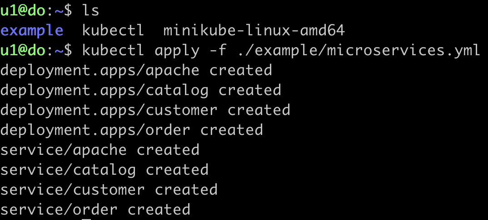

**Шпора по командам**
`https://kubernetes.io/ru/docs/reference/kubectl/cheatsheet/`

Проверим, что поды поднялись:

`kubectl get pods`

Результат:
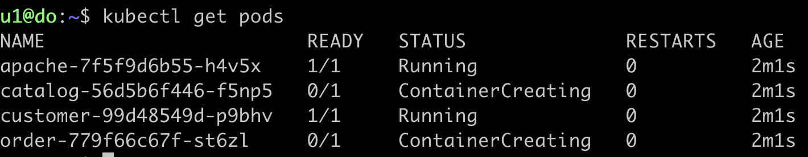

Как мы видим, не все поды доняты. подождём.

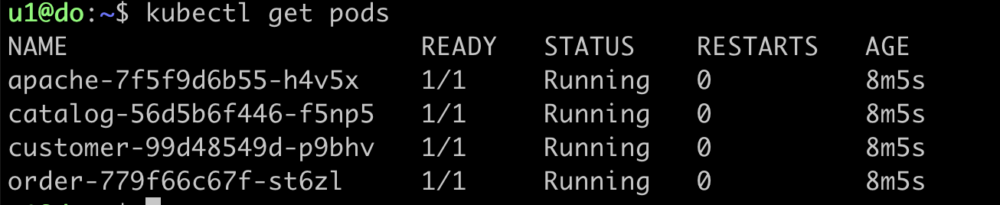

Получим больше информации:

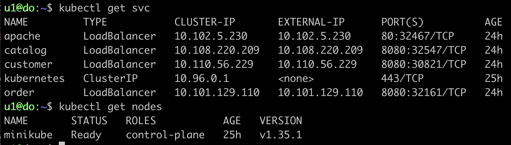

Отлично! У нас получилось. Теперь нужно получить доступ к борде. Куб крутится на виртуалке. 

Я получал доступ к борде двумя способами:

- Простым
- Потным

**Простой метод**

1) Поднимем борду:

`minikube dashboard --url`

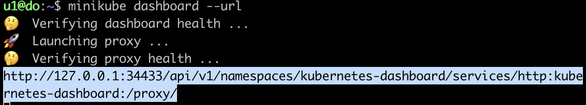

После того, как мы пробросим локальный порт, мы перейдём по этой ссылке.

2) На хосте пробросим локальный порт через ssh-туннель

ssh -L [порт_на_хосте]:[url]:[port] -p [порт_вашего_ssh] [username]@localhost

[url], [port] берём из url, что дал куб

В моём случае:

ssh -L 34433:127.0.0.1:34433 -p 2200 u1@localhost

3) На хосте переходим по ссылке, что дал куб:

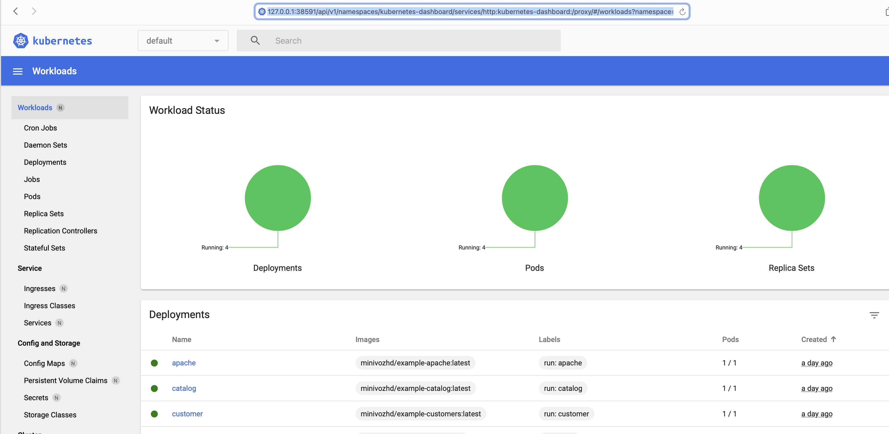

**Потный метод**

2) Посмотрим порты дэшборды:
`kubectl -n kubernetes-dashboard get svc`

3) прокинем порт:

`kubectl port-forward svc/kubernetes-dashboard 8080:80 -n kubernetes-dashboard -address 0.0.0.0`

Это костыли и велосипеды. Вроде бы так делает куб под капотом, но нам- то так зачем?

4) Создадим ssh-тунель с хоста для доступа к борде:
`ssh -L 8080:localhost:[PORT] [username]@localhost`

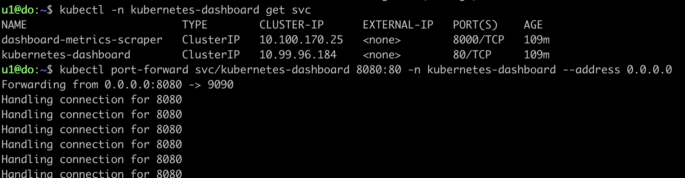

На скриншоте уже есть логи успешных обращений к борде. Это - норма

3) получим токен:

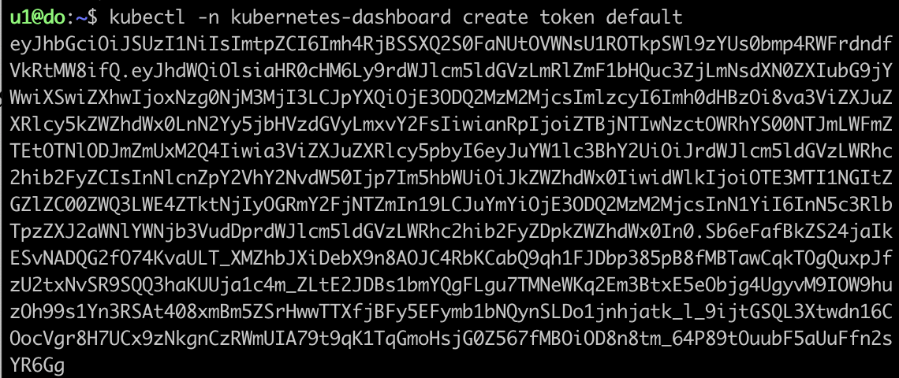

Получаем на всякий случай, поскольку после проброски с нас токен не требуют. Мы будем забирать борду в обход proxy

4) Получим результат:

Идём по адресу `localhost:8080`

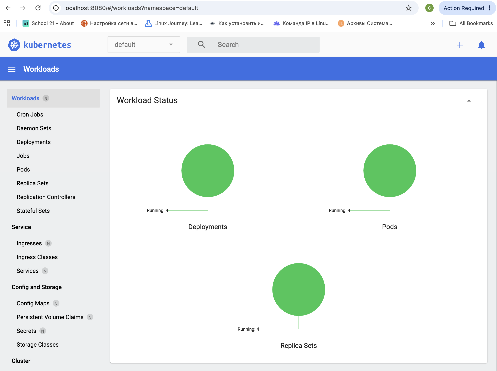

Борду мы получили! Теперь нужно получить доступ к apache.

**Получим доступ к apache**

Пойдём тем же путём:

1) создадим временный туннель посредством:
`minikube service apache`

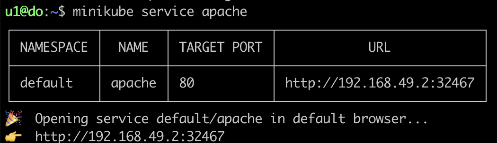

2) Пробросим локальный порт: 

`ssh -L 8080:192.168.49.2:32467 -p 2200 u1@localhost`

3) обратиться к localhost:8080

>Можно попробовать связку: 
kubectl port-forward svc/apache 8080:80
+
ssh -N -L 8080:127.0.0.1:8080 -p 2200 login@localhost
+
http://localhost:8080

Работать будет, но это геммор.

Результат:

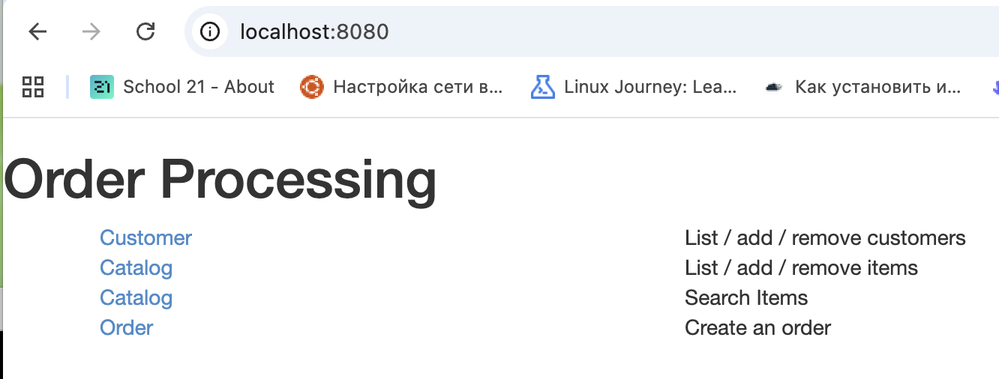

Мы - молодцы. Порты кидать умеем)

## Part 2. Написание собственного манифеста

### 2.1 декомпозиция

Декомпозируем задачу. Нужно:
- Выявить переменные, применяемые микросервисами
- Определить, какие из переменных определить в ConfigMaps, какие в Secrets
- Создать, наполнить файлы 
- Понять как передать 
- Понять как поднять Kubrenetes 
- Поднять kubernetes с готовым манифестом

Начнём с выявления переменных:

### 2.2 поиск переменных

По пути `src/services/` лежат сервисы, которые мы должны поднять. По пути `src/services/[service_name]/src/main/resources` для каждого проекта лежит файл `application.properties`. Его содержимое - необходимые для работы переменные и конфиги.

Пример содержимого такого файла:

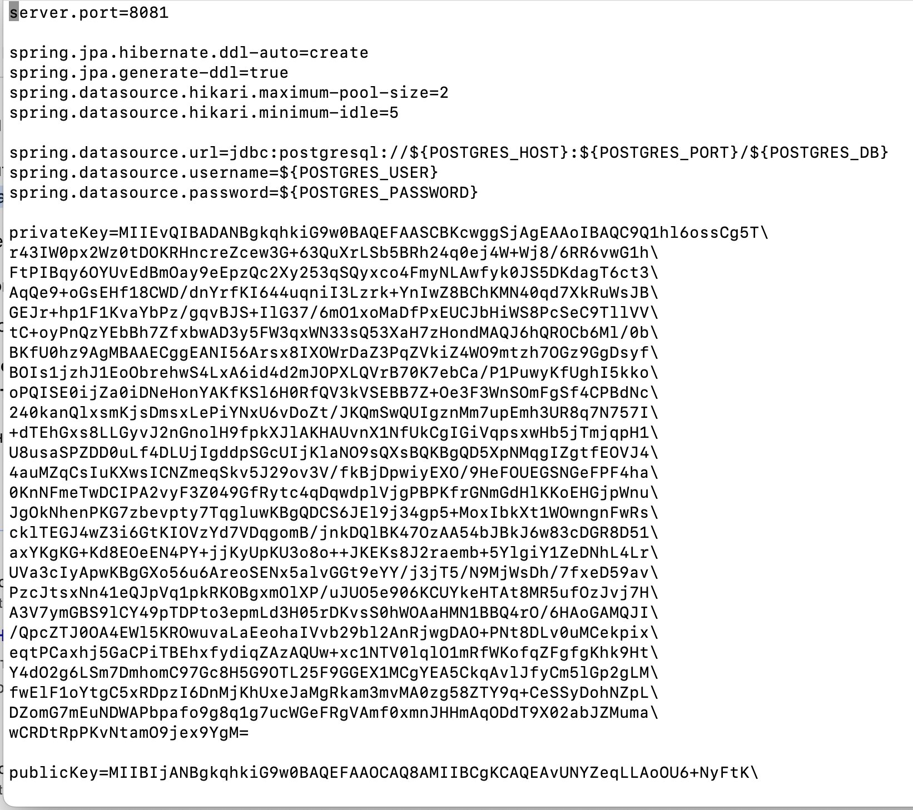

Вещи, которые следует поместить в ConfigMaps:
- URL
- Хосты
- publicKey

Если кратко, данные не чувствительные к разглашению

Вещи, которые точно Secrets:
- username
- password
- privateKey
- UUID (если не публичные)

Тут только то, что может участвовать в аутентификации, влияет на безопасность.

Порты - в `Dockerfile` или в `application.properties`. Указание портов в ConfigMaps жёстко связывает конфигурацию с инфраструктурой, что делает конфиг неуниверсальным. Антипаттерн, короче. Да, и вообще принцип "Один порт - одна сущность (Service)" нарушается. И масштабирование ломается. Короче, фу таким быть.

Сколько должно быть ConfigMaps и Secrets?
Есть три пути:

1) Большинство мнений сходится на том, что один сервис - отдельные configMaps и secrets
2) Для общих ресурсов - общий, уникальные конфиги - отдельные configMaps, secrets
3) Общий глоссарий для всего кластера с переменными.

Что по нашему проекту? 
У нас 7 сервисов и около 20 переменных вообще. Делать для каждого отдельный ConfigMaps - оверинжиниринг, что **ТОЖЕ** антипаттерн. Сделаем по третьему пути.

Единственная поправка:

В `application.properties` ссылки на сервисы захардкожены так: 
`spring.datasource.url=jdbc:postgresql://${POSTGRES_HOST}:${POSTGRES_PORT}/${POSTGRES_DB}`

То, есть если мы будем бездумно впсывать в ConfigMaps переменные, все сочетания ключ=значение, что встретим в конфигах сервисов мы получи больше 5 пар с одинаковым ключом  `POSTGRES_DB`. Куб считает посоледний, проигнорировав предыдущие. Создадим уникальные имена для всех переменных, а чтобы не ломать файлы `application.properties`для каждого сервиса - пропишем переменную с каким ключом брать в поле spec манифеста.

### 2.3 Пишем конфиги:

Пишем стандартную шапку, перечисляем переменные в поле data (configmap) и stringData (secret)

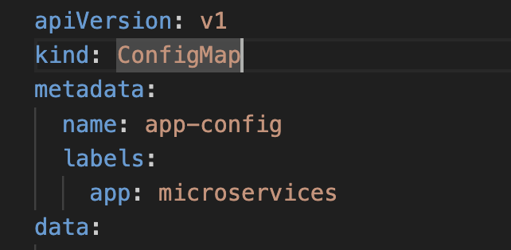

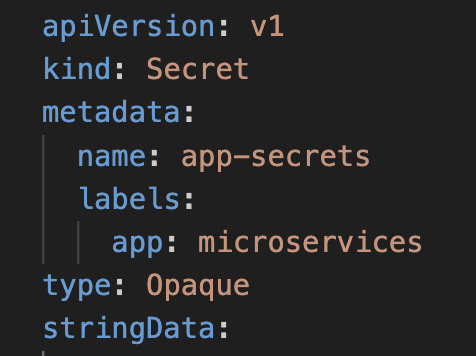

Важные моменты: 

Если private/public ключи записаны в таком формате:

`privateKey=MIIEvQIBADANBgkqhkiG9w0BAQEFAASCBKcwggSjAgEAAoIBAQC9Q1hl6ossCg5T\
r43IW0px2Wz0tDOKRHncreZcew3G+63QuXrLSb5BRh24q0ej4W+Wj8/6RR6vwG1h\
FtPIBqy6OYUvEdBmOay9eEpzQc2Xy253qSQyxco4FmyNLAwfyk0JS5DKdagT6ct3\`

Стоит переносы убрать, строки склеить:

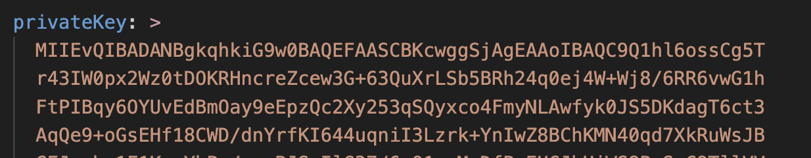

Передадим configmap.yaml, secret.yaml на машину с кубом:

scp -P [порт] путь/к файлам [логин]@localhost:путь/к_папке_назначения

Применим конфиги: 

`kubectl apply -f ./путь_к_файлу`

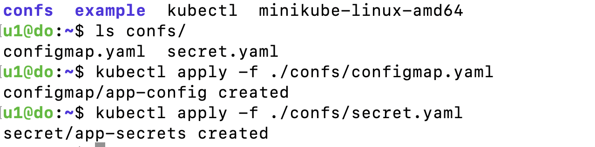

посмотрим, что создалось:

`kubectl get configmap app-config`
`kubectl get secret app-secrets`

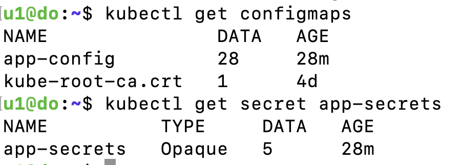

Посмотрим на содержание:

`kubectl describe configmap app-config`

`kubectl describe secret app-secrets`

>Если запросить просто, к примеру `kubectl describe configmap`, мы получим configmap системы по умолчанию, автоматически созданный kubernetes, а не тот, что мы создали.

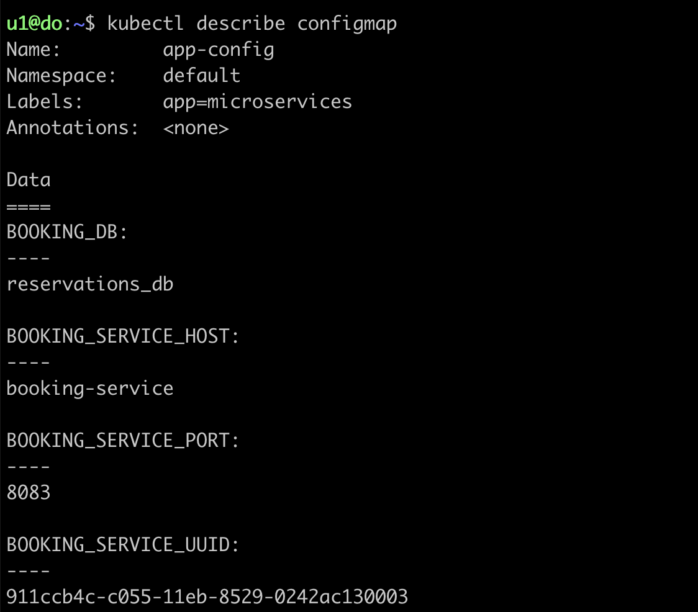
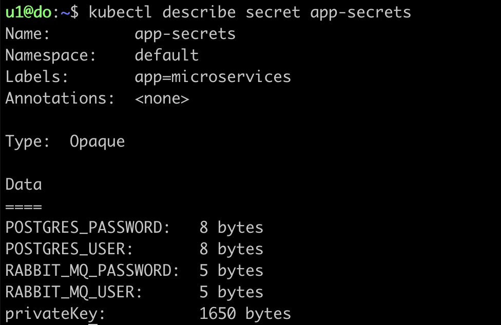

>Как мы видим, команда `kubectl describe secret app-secrets` выводит только метаданные. Чтобы получить само содержание, необходимо получить сам `.yaml`

`kubectl get secret app-secrets -o yaml`

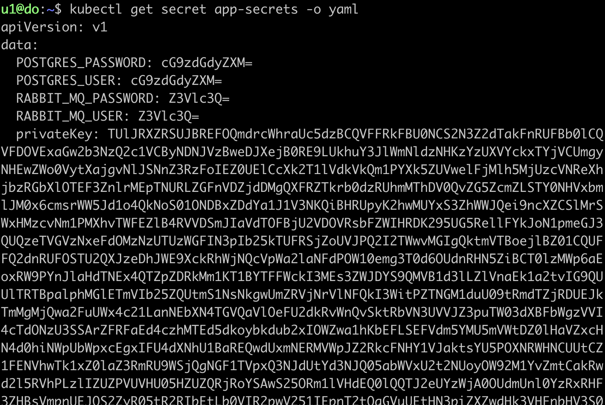

Чаще всего, косяки вылезают при передаче public/private -ключей. Наиболее правильный способ передачи - одной строкой. Если в падлу, то через `|-`.   
`|` - сохраняет все переносы, `-` - удаляет поледний прернос/пустую строку

### 2.4 Пишем deployment'ы

Начнём с написания postgres deployment'a.

Структура:

1) Шапка: 

`apiVersion: apps/v1
kind: Deployment`

2) Поля:  

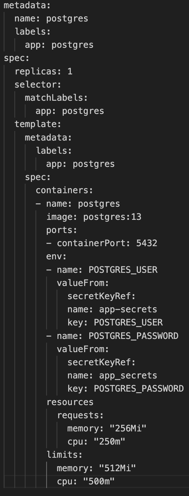

- replicas: 1  - одна копия
- selector.matchLeabels - метка, по которой куб находит нужные поды 
- template.metadata.labels - метки для связи пода с контроллером. Метка должна совпадать с селектором
- env - переменные окружения
- resources - ограничения по выдаваемым ресурсам

Добавим поле `volumes` для того, чтобы создавались необходимые базы данных при запуске контейнера

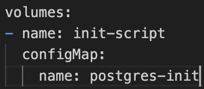